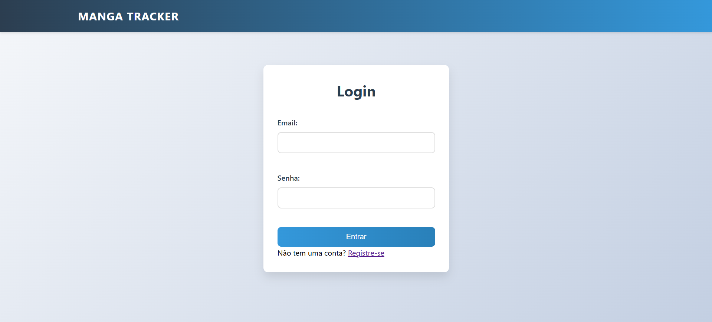
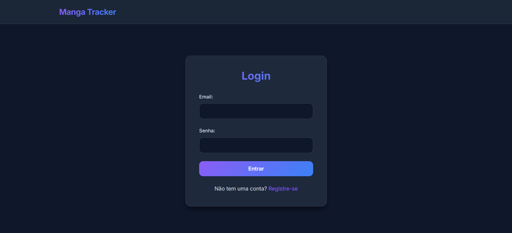
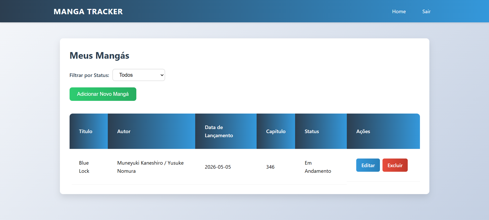
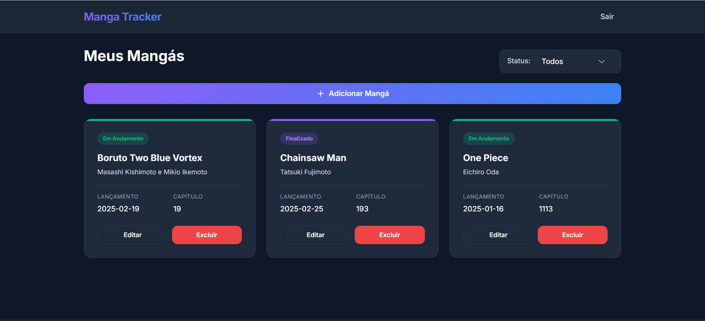

# 📚 Manga Reading Tracker

## 📌 About the Project

This project is a full-stack CRUD application developed to help users track their manga reading progress. It includes user authentication, manga management features, filtering options and a responsive interface designed for both desktop and mobile devices.

---

## 📌 About the Project

This project is a CRUD system developed to help users track the mangas they have read, including relevant information such as title, author, reading date, chapter and status.

---

## ✨ Features

- ➕ Add new manga entries
- 📖 View all registered mangas
- ✏️ Edit existing entries
- ❌ Delete entries
- 🔍 Filter mangas by status:
  - Ongoing
  - Hiatus
  - Completed
- 🔐 User authentication system
- 📱 Responsive design for desktop and mobile devices

---

## 📸 UI Improvement (Before vs After)

### 🔐 Login Screen

**Before**  


**After**  


---

### 📚 Dashboard (Manga List)

**Before**  


**After**  


---

## 🛠️ Technologies Used

- **Frontend:** HTML, CSS, JavaScript
- **Backend:** Python (Flask)
- **Database:** SQLite

---

## ⚙️ Installation

### 1. Clone the repository

```bash
git clone https://github.com/luisfrancisco2b/manga-reading-tracker
```

### 2. Navigate to the project folder

```bash
cd manga-reading-tracker
```

### 3. Install dependencies

```bash
pip install flask flask-sqlalchemy
```

---

## 🚀 Running the Project

Run the following command:

```bash
python app.py
```

Then open your browser and access:

http://localhost:5000

---

## 🤖 Development Approach

This project was initially developed with the support of AI-assisted tools to accelerate learning and prototyping.  
It has been improved with a focus on UI, usability and code organization.

---

## 👨‍💻 Author

Luis Francisco
